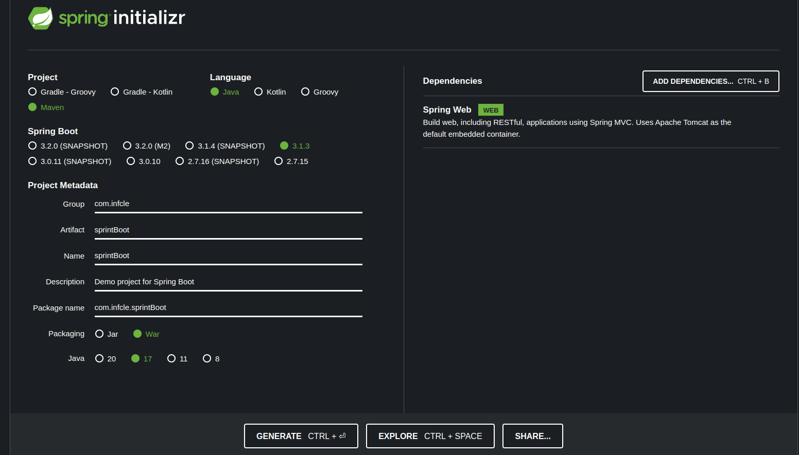

## Inicializacion de proyecto

Para iniciar un proyecto nuevo se debe de generar a travez del siguiente link
https://start.spring.io/

### Pasos de configuracion
* **Seleccionar **MAVEN** o **GRADLE**:** Son librerias que permiten descargar otras librerias Como ***composer*** y ***npm***
* **Seleccionar Lenjuaje jAVA KOTLIN GROOVY:** Lenguaje de programacion en el que se desarrollara
* **Selecionamos la version de SPRINT BOOT:** Utilizaremos la version *3.1.3* que para esta fecha es la ultima version
* **Configuramos el proyecto :** Se debe de configurar los siguientes Metadata
  * **Group:** ***com.infcle*** *'Es solo un ejemplo del grupo'*
  * **Artifact:** ***sprintBoot*** *'Es solo un ejemplo del grupo'*
  * **Name:** ***sprintBoot*** *'Es solo un ejemplo del grupo'*
  * **Description:** ***Demo project sprint Boot*** *'Es solo un ejemplo del grupo'*
  * **Package name:** ***com.infcle.sprintBoot*** *'Es solo un ejemplo del grupo  que se genero con los datos anteriores'*
  * **Seleccionar Packaging:** ***Jar*** o ***War*** 'Jar es para escritorio, y War para web, por ende usaremos **war**'
  * **Version de Java:** Tenemos la ***20, 17, 11, 8*** 'Elegiremos el **17**'
  * **Añadimos Dependencias:** Seleccionamos ***Sprint web***

Debe de quedar como la siguiente imagen

