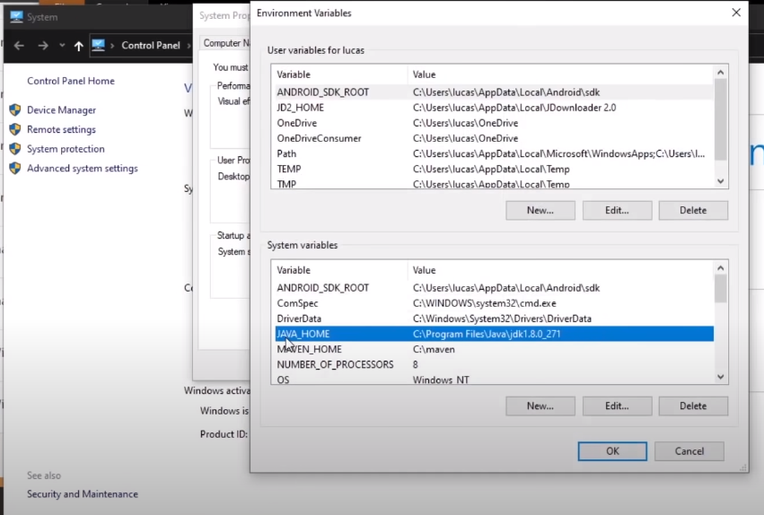
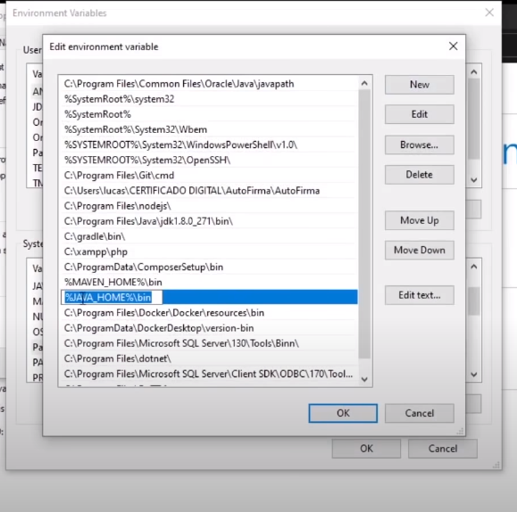

## Instalacion windows

1. Ingresar al sitio web oficial https://www.oracle.com/java/technologies/downloads/
2. Seleccionar la plataforma windows y descargar
3. Instalamos y copiamos la ruta de instalacion
4. Establecemos una variable de entorno **JAVA_HOME** con el valor de la ruta donde se instalo java **C:\Program File\Java\jdk-17...**
5. Modificamos el path, agregamos una nueva variable con el valor **%JAVA_HOME\bin%**

