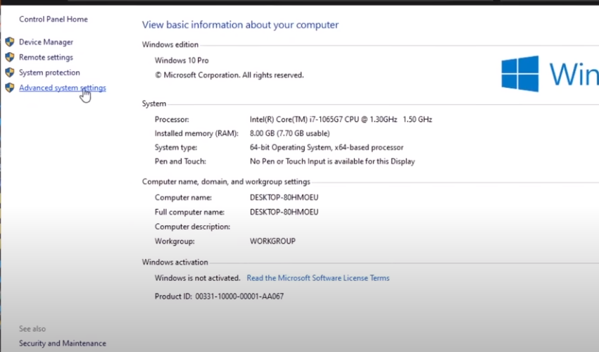
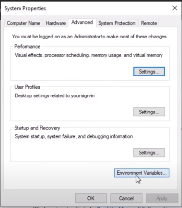
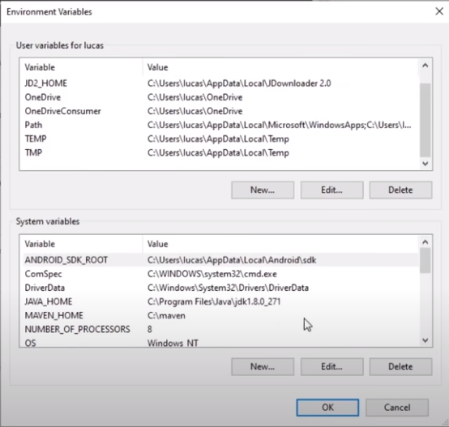
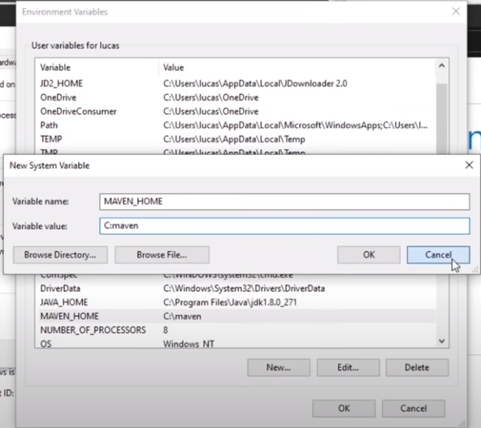
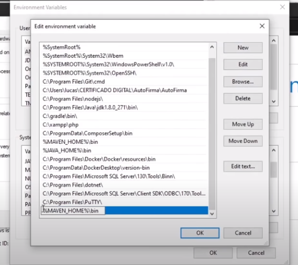

## instalación windows
1. Dirigirse al sitio web de maven https://maven.apache.org
2. Ir a al seccion dowload https://maven.apache.org/download.cgi
3. Buscamos la que dice binary zip (que es la version compilada) la descargamos
4. En nuestro caso lo descomprimos en la C:
5. Añadimos variables de entorno en ***System variables***
6. El nombre de la variable sera ***MAVEN_HOME*** y la ruta ***c:/maven***, ya que cambiamos el nombre de la carpeta a maven
7. Luego modificamos el ***path***, añadimos ***%MAVEN_HOME%\bin*** 'de esa manera tendremos todos los comandos de maven en todo el sistema cuando arranque'

